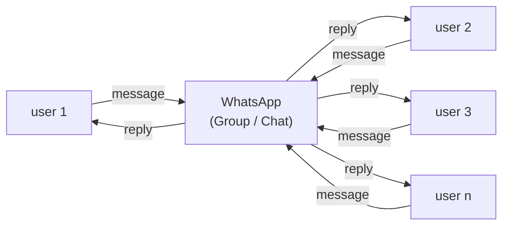
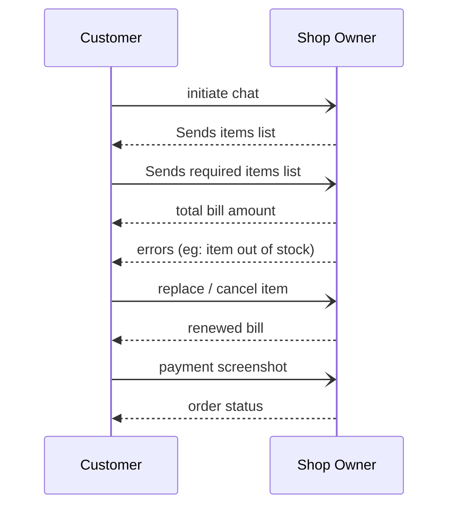
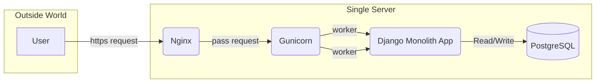
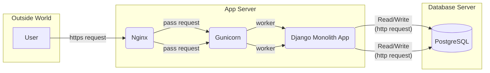
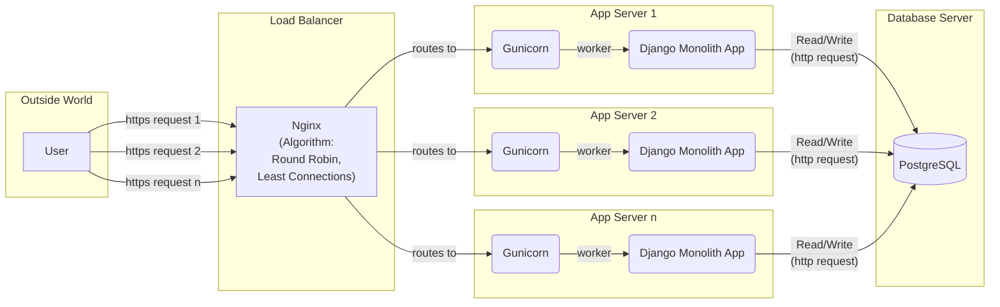

## Before Dukaan (pg 18)

### A customer interacting with a busy WhatsApp-Shop Owner

---

## Single Box / Monolith (pg 34)

---

## Separating App & DB (pg 43)

---

## The Traffic Cop (Nginx Load Balancing) (pg 74)

---