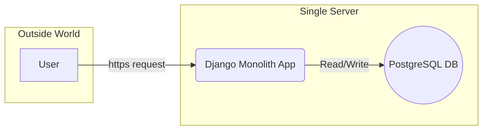
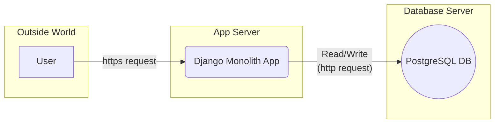
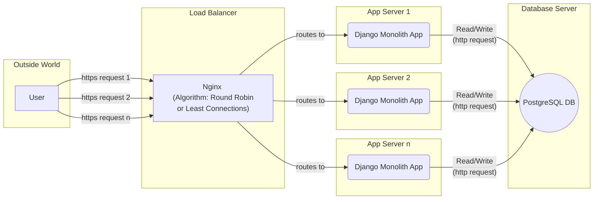

## Single Box (Monolith)

```mermaid
%%{init: {'flowchart': {'htmlLabels': false,}}}%%
graph LR
  %% Nodes
  A[User]
  B(Django Monolith App)
  C((PostgreSQL DB))
  
subgraph Outside World
direction LR
  A 
end

subgraph Single Server
direction LR
  A -- https request --> B
  B -- Read/Write --> C
end
```

## Separating App & DB

```mermaid
%%{init: {'flowchart': {'htmlLabels': false,}}}%%

graph LR
  %% Nodes
  A[User]
  B(Django Monolith App)
  C((PostgreSQL DB))

subgraph Outside World
direction LR
  A 
end

subgraph App Server
direction LR
  A -- https request --> B
end

subgraph Database Server
direction LR
  B -- Read/Write<br>(http request) --> C
end
```

## The Traffic Cop (Nginx Load Balancing)

```mermaid
%%{init: {'flowchart': {'htmlLabels': false,}}}%%

graph LR
  %% Nodes
  A[User]
  B["Nginx <br> (Algorithm: Round Robin or Least Connections)"]
  B1(Django Monolith App)
  B2(Django Monolith App)
  B3(Django Monolith App)
  C((PostgreSQL DB))

subgraph Outside World
direction LR
  A 
end

subgraph Load Balancer
direction LR
  A -- https request 1 --> B
  A -- https request 2 --> B
  A -- https request n --> B
end

subgraph App Server 1
direction LR
  B -- routes to --> B1
end

subgraph App Server 2
direction LR
  B -- routes to --> B2
end

subgraph App Server n
direction LR
  B -- routes to --> B3
end

subgraph Database Server
direction LR
  B1 -- Read/Write<br>(http request) --> C
  B2 -- Read/Write<br>(http request) --> C
  B3 -- Read/Write<br>(http request) --> C
end
```