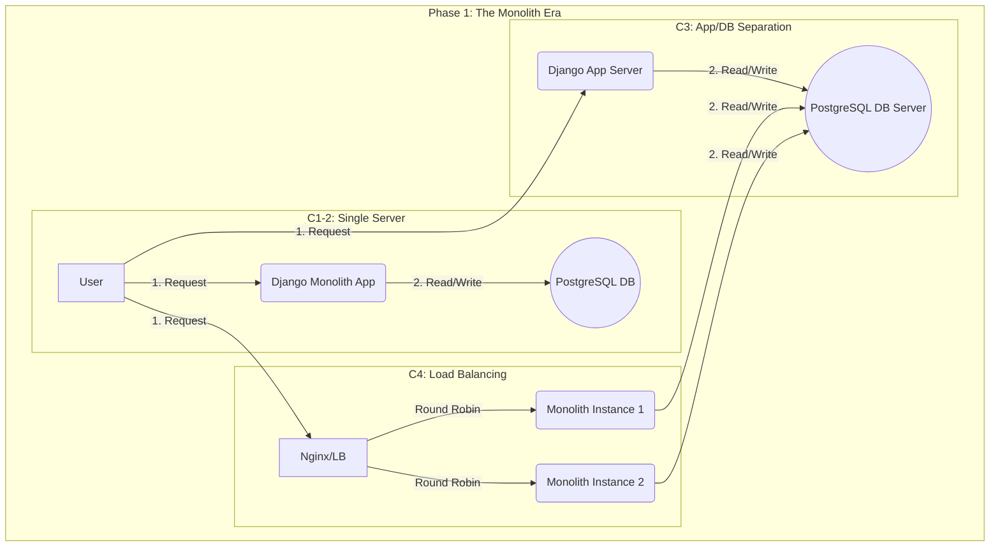

This file is named as README to see the figures rendered o

```mermaid
%%{init: {'flowchart': {'htmlLabels': false}}}%%
graph TD
    subgraph Phase 1: The Monolith Era
        direction LR
        
        %% Nodes (Shapes/Conceptual Components)
        A[User]
        B((PostgreSQL DB))
        C[Nginx/LB]
        D(Django Monolith App)
        E(Django Monolith App 2)
        
        %% Chapter 1-2: Single Box (Monolith)
        subgraph C1-2: Single Server
            A -->|1. Request| D
            D -->|2. Read/Write| B
        end
        
        %% Chapter 3: The Great Divorce (App & DB Separation)
        subgraph C3: App/DB Separation
            D_sep(Django App Server)
            B_sep((PostgreSQL DB Server))
            A -->|1. Request| D_sep
            D_sep -->|2. Read/Write| B_sep
        end
        
        %% Chapter 4: The Traffic Cop (Load Balancing)
        subgraph C4: Load Balancing
            A -->|1. Request| C
            C --Round Robin--> D_lb(Monolith Instance 1)
            C --Round Robin--> E(Monolith Instance 2)
            D_lb -->|2. Read/Write| B_sep
            E -->|2. Read/Write| B_sep
        end
    end
```
