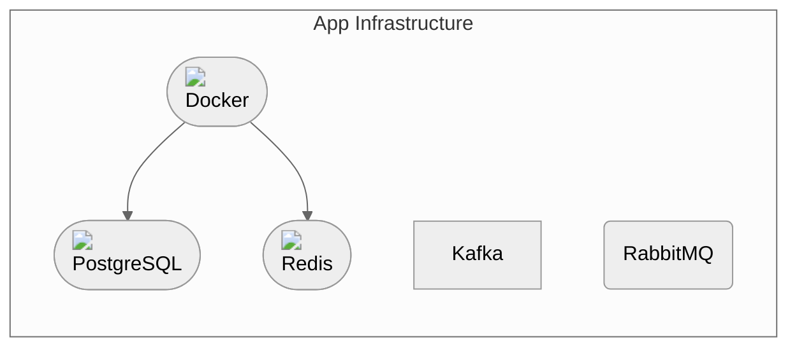

```mermaid
%%{init: {"theme": "neutral"}}%%
graph LR
  subgraph "App Infrastructure"
    A(["<img src='svg/Redis.svg' width='25'/> Docker"])
    B(["<img src='svg/Python.svg' width='10'/> PostgreSQL"])
    C(["<img src='svg/PostgresSQL.svg' width='15'/> Redis"])
    D[Kafka]
    E(RabbitMQ)
  end
  A --> B
  A --> C
```