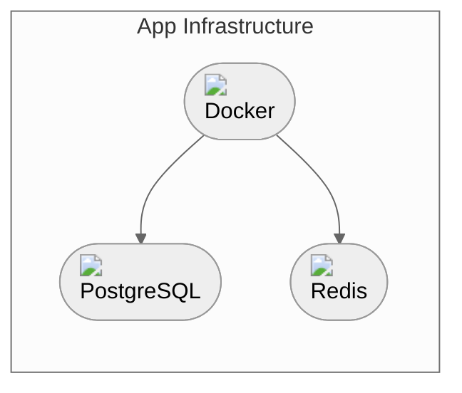

```mermaid
%%{init: {"theme": "neutral"}}%%
graph LR
  subgraph "App Infrastructure"
    A(["<img src='svg/Redis.svg' width='25'/> Docker"])
    B(["<img src='svg/Python.svg' width='25'/> PostgreSQL"])
    C(["<img src='../assets/icons/redis.svg' width='25'/> Redis"])
  end
  A --> B
  A --> C
```